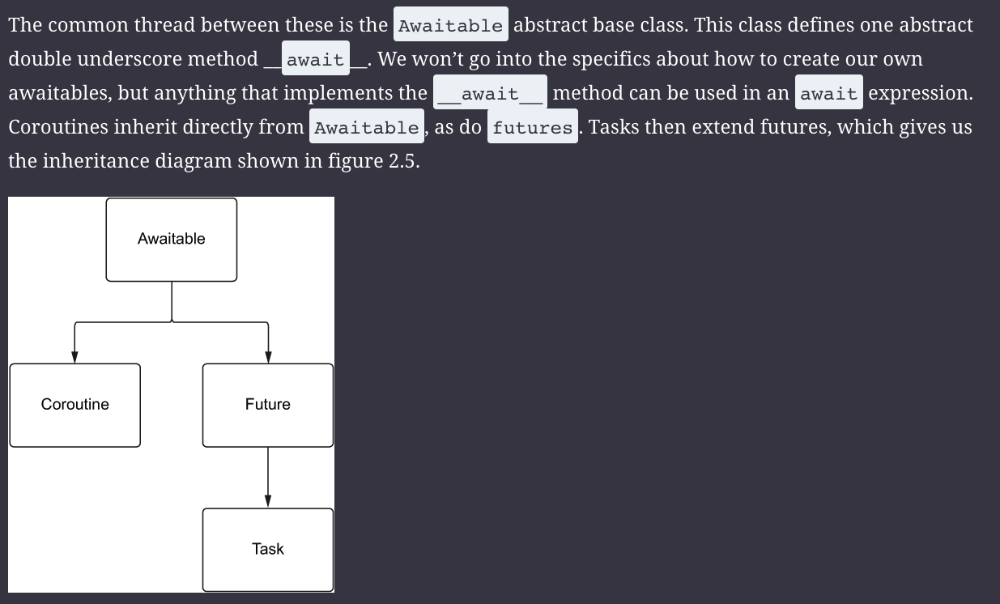

# python asyncio concept
1. coroutine is a function. create with f = async def, f() is coroutine
2. future is an awaitable object, task is a subclass of future. 
3. task can be create with asyncio.create_task() or loop.create_task()
4. task -> future can be coverted using asyncio.ensure_future()

